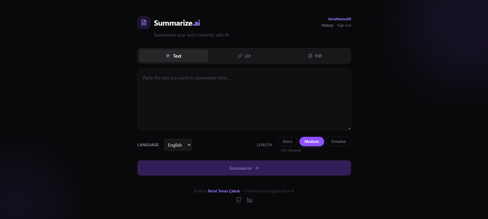

# Summarize.ai — AI-Powered Text Summarizer

**[Live Demo](https://ai-summarizer-chi-six.vercel.app)** | **[API Docs](https://ai-summarizer-iwtj.onrender.com/docs)**

A full-stack web application that summarizes long texts and web articles using artificial intelligence. Built with **FastAPI** (Python) on the backend and **React** on the frontend, powered by Hugging Face's BART model.

> **Note:** The backend is hosted on Render's free tier, so the first request may take ~50 seconds while the server wakes up.



## Features

- **Text Summarization** — Paste any long text and get a concise AI-generated summary
- **URL Scraping** — Enter a URL and the app automatically extracts and summarizes the article content
- **Adjustable Length** — Choose between short, medium, and detailed summary outputs
- **Smart Truncation** — Handles large texts gracefully with automatic truncation and user notification
- **Copy to Clipboard** — One-click copy for the generated summary
- **Responsive Design** — Dark theme UI that works on desktop and mobile

## Tech Stack

| Layer | Technology |
|-------|-----------|
| **Frontend** | React, Tailwind CSS, Vite |
| **Backend** | Python, FastAPI, Uvicorn |
| **AI Model** | Hugging Face Inference API (`facebook/bart-large-cnn`) |
| **Web Scraping** | BeautifulSoup4, httpx |
| **Environment** | python-dotenv |
| **Containerization** | Docker |
| **Backend Hosting** | Render (Docker) |
| **Frontend Hosting** | Vercel |

## Architecture

```
Client (React on Vercel) → HTTP POST /summarize → FastAPI Backend (Render)
                                                      ├── Text input → Hugging Face API → Summary
                                                      └── URL input  → Scrape with BS4 → Hugging Face API → Summary
```

## API Endpoints

### `GET /`
Health check endpoint.

**Response:**
```json
{ "message": "Welcome to AI Summarizer API" }
```

### `POST /summarize`
Summarize text or a web article.

**Request Body:**
```json
{
  "text": "Your long text here...",
  "url": null,
  "length": "medium"
}
```

| Field | Type | Description |
|-------|------|-------------|
| `text` | `string \| null` | Raw text to summarize |
| `url` | `string \| null` | URL to scrape and summarize |
| `length` | `string` | Summary length: `short`, `medium`, or `long` |

**Response:**
```json
{
  "summary": "AI-generated summary text.",
  "truncated": false
}
```

## Getting Started

### Prerequisites
- Python 3.10+
- Node.js 18+
- Hugging Face account (free) — [huggingface.co](https://huggingface.co)

### Backend Setup

```bash
cd backend
python -m venv venv

# Windows
.\venv\Scripts\Activate
# macOS/Linux
source venv/bin/activate

pip install -r requirements.txt
```

Create a `.env` file in the `backend/` directory:

```
HUGGINGFACE_API_KEY=your_hf_token_here
```

Start the server:

```bash
python -m uvicorn main:app --reload
```

The API will be available at `http://127.0.0.1:8000`. Visit `http://127.0.0.1:8000/docs` for interactive API documentation.

### Frontend Setup

```bash
cd frontend
npm install
npm run dev
```

The app will be available at `http://localhost:5173`.

### Docker Setup

```bash
cd backend
docker build -t ai-summarizer-backend .
docker run -p 8000:8000 ai-summarizer-backend
```

## Error Handling

- **503 Service Unavailable** — Returned when the Hugging Face model is loading or unavailable
- **400 Bad Request** — Returned for invalid/unreachable URLs or missing input
- **422 Validation Error** — Returned when the request body doesn't match the expected schema

## Project Structure

```
ai-summarizer/
├── backend/
│   ├── main.py            # FastAPI application & endpoints
│   ├── Dockerfile         # Docker configuration
│   ├── .dockerignore
│   ├── .env               # API keys (not committed)
│   └── requirements.txt
├── frontend/
│   ├── src/
│   │   ├── App.jsx        # Main React component
│   │   ├── index.css      # Tailwind imports
│   │   └── main.jsx       # React entry point
│   ├── package.json
│   └── vite.config.js
├── .gitignore
└── README.md
```

## Future Improvements

- [x] Multi-language summarization support
- [ ] PDF file upload and summarization
- [ ] User authentication and summary history
- [x] Docker containerization
- [x] Deploy to cloud (Render + Vercel)

## Author

**Berat Tansu Çabuk** — Software Engineering Student

- GitHub: [@BeratTansu](https://github.com/BeratTansu)
- LinkedIn: [Berat Tansu Çabuk](https://www.linkedin.com/in/berat-tansu-çabuk-02b55b244/)
- Portfolio: [berattansu.dev](https://berattansu.dev)

## License

This project is open source and available under the [MIT License](LICENSE).
